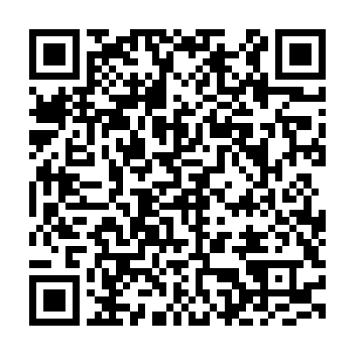

# Exemplo de LandPage

Este é um projeto de uma página de vendas com rastreamento de acessos. assim você saberá de onde estão acessando sua página.

 

# Caso queira dar uma olhada na pagina online fique a vontade.

https://www.filtramais.com/

## Tecnologias utilizadas

- 
- 
- 
- 

## Contato

- Whatsapp: 
- E-mail: 
- LinkedIn: 

## Como clonar e executar o projeto

# 1. Clone o repositório:

git clone https://github.com/NatalSantiago/PAGINAVENDAS

Apoie o Projeto, Faça uma doação via Pix.
Fale Conosco: (63) 9 9225-9154

